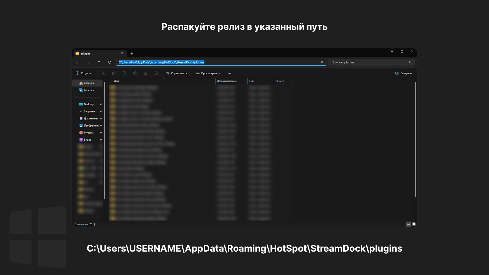
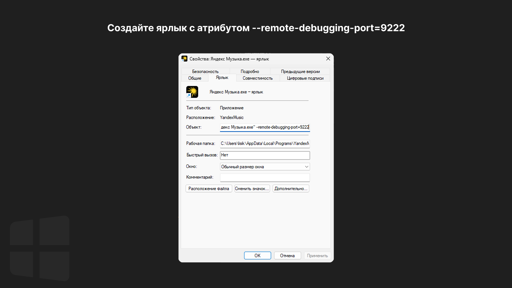
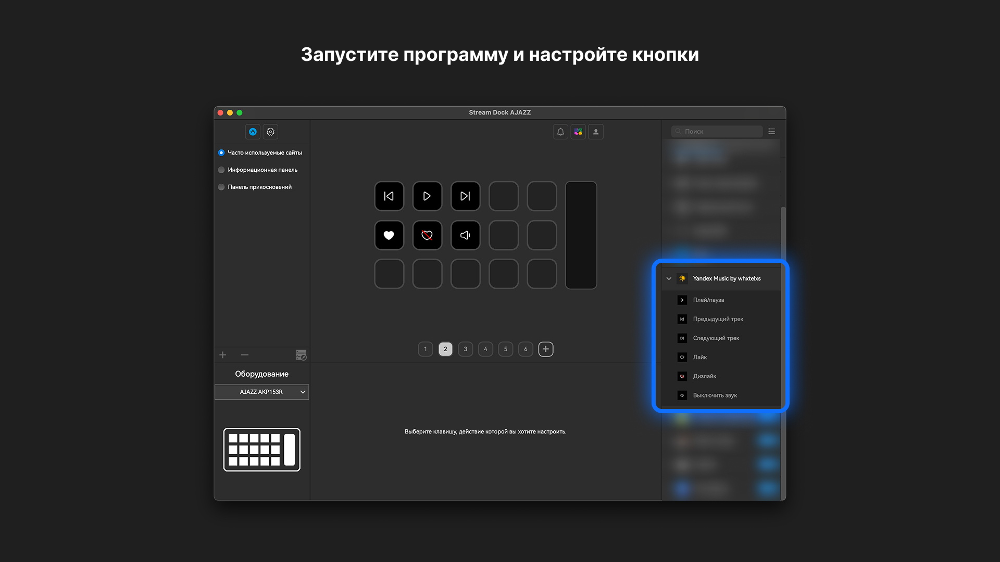
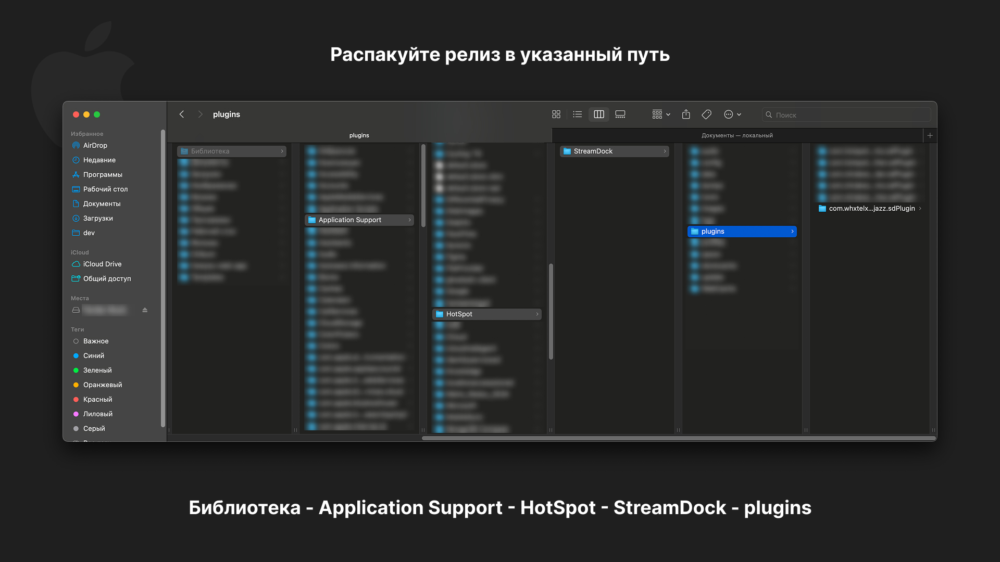
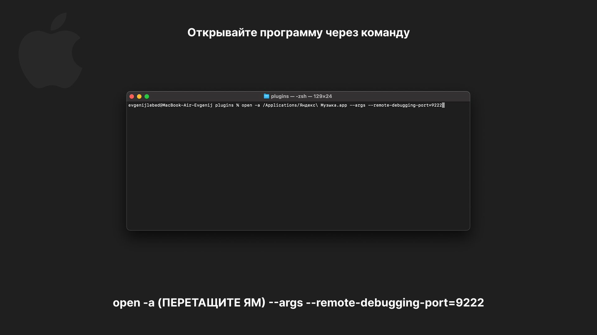
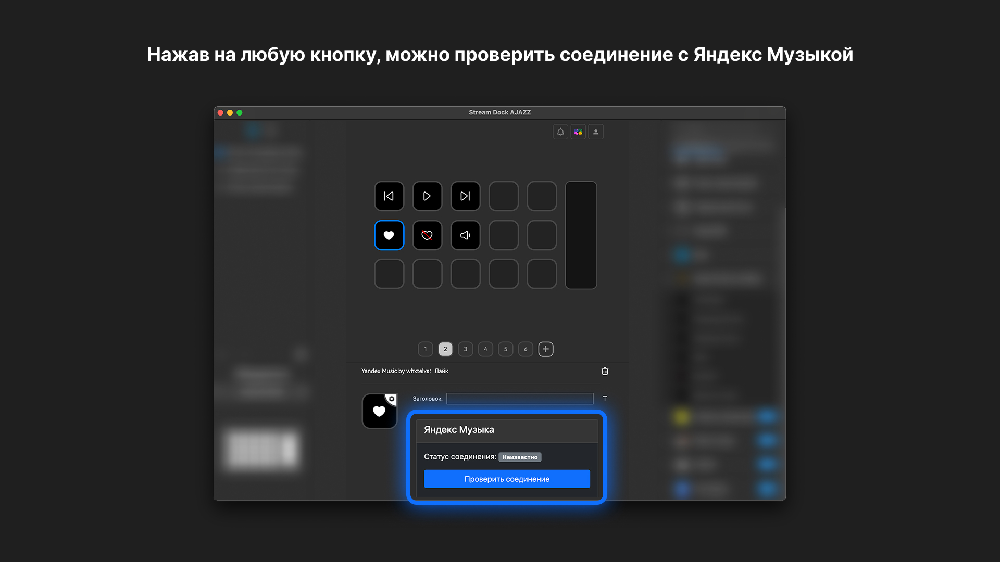

# Yandex Music Ajazz Plugin


Плагин для управления приложением Яндекс.Музыка с помощью Ajazz AKP 153 и других устройств StreamDock.

> [!CAUTION]
>
> ### Моя волна обновилась
> В текущей моей волне плагин ВРЕМЕННО не работает  
> Используйте вкладку Коллекция, там проблем не будет, апдейт под новую версию будет выпущен в ближайшее время.

## Возможности

### Кнопки
- **Плей/Пауза** — воспроизведение и пауза трека
- **Следующий/Предыдущий трек** — переключение треков
- **Лайк/Дизлайк** — оценка текущего трека с отображением состояния
- **Случайный порядок** — включение и выключение shuffle с отображением состояния на кнопке
- **Повтор** — переключение режима повтора (выкл → список → один трек), иконка соответствует текущему режиму
- **Громкость + / Громкость −** — шаг изменения громкости настраивается в панели свойств (1–99%, по умолчанию 5%)
- **Выключить звук** — mute/unmute с отображением состояния
- **Обложка трека** — обложка текущего трека; нажатие — плей или пауза
- **Название трека** — бегущая строка формата "Артист - Название"
- **Время трека** — текущее время / общая длительность

### Энкодеры (Крутилки)
- **Громкость (Энкодер)** — вращение: изменение громкости, нажатие: mute/unmute
- **Перемотка (Энкодер)** — вращение: перемотка трека, нажатие: плей/пауза
- **Треки (Энкодер)** — вращение: следующий/предыдущий трек, нажатие: плей/пауза

## Совместимость

### Клавиатуры
- Ajazz AKP153
- Ajazz AKP05 (с энкодерами)
- Mirabox N4

### Системы
- Windows 11 24H2
- Windows 10
- MacOS 15

### Приложения
- Yandex Music 5.68.0+
- Yandex Music Mod 1.34.0+

## Установка

<details>
<summary>Windows</summary>

1. Скачайте релиз и распакуйте папку по пути 
  ```
C:\Users\USERNAME\AppData\Roaming\HotSpot\StreamDock\plugins
  ```


2. Создайте ярлык Яндекс Музыки и в параметрах укажите 
  ```
--remote-debugging-port=9222
  ```


3. Запустите ярлык, откройте StreamDock и настройте кнопки


</details>

<details>
<summary>MacOS</summary>

1. Скачайте релиз и распакуйте папку по пути 
  ```
Библиотека - Application Support - HotSpot - StreamDock - plugins
  ```



2. Откройте терминал и запустите Яндекс Музыку через команду 
  ```
open -a /Applications/Яндекс\ Музыка.app --args --remote-debugging-port=9222
  ```


3. Откройте StreamDock и настройте кнопки


</details>

## Настройка энкодеров

Для устройств с крутилками (например, Ajazz AKP05):

1. Откройте StreamDock и перейдите во вкладку **Knob**
2. Найдите категорию **Yandex Music**
3. Перетащите нужный энкодер на крутилку устройства:
   - **Громкость (Энкодер)** — управление громкостью
   - **Перемотка (Энкодер)** — перемотка и плей/пауза
   - **Треки (Энкодер)** — переключение треков и плей/пауза

## Проверка соединения

Проверьте статус соединения, нажав на любую кнопку, а затем на "Проверить соединение"



> ⚠️ Убедитесь, что порт `9222` свободен и приложение Яндекс.Музыка не запущено до выполнения этих действий.

## Автор

[whxtelxs](https://whxtelxs.dev)
