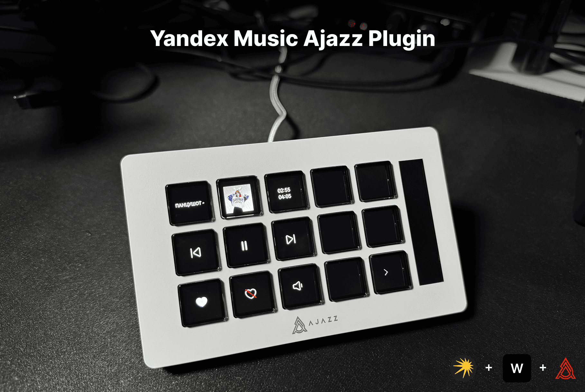
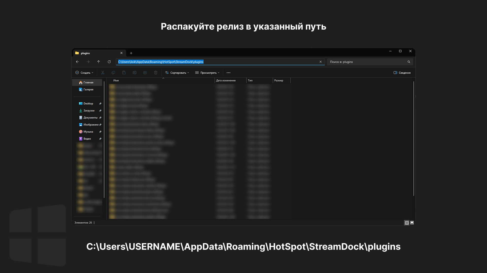
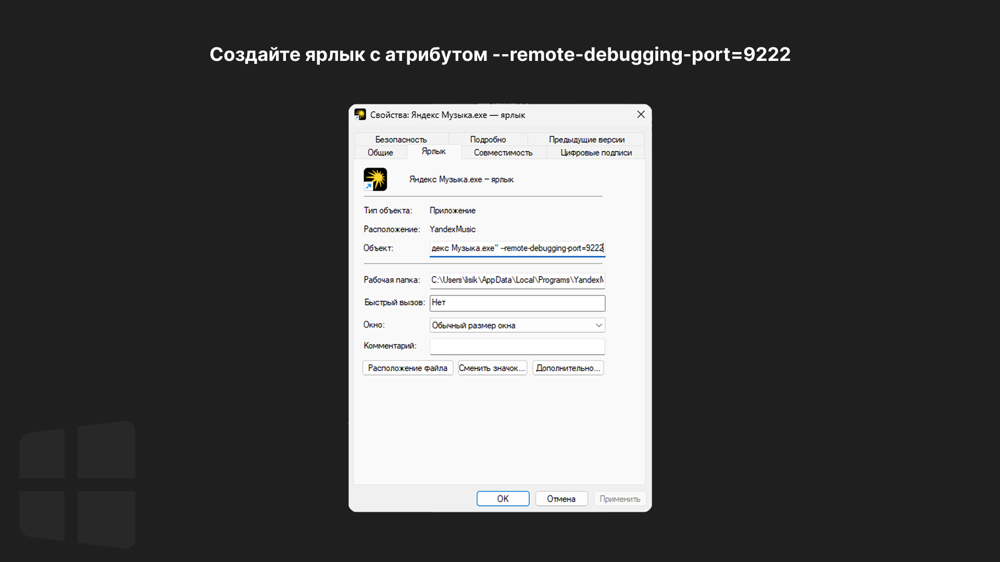
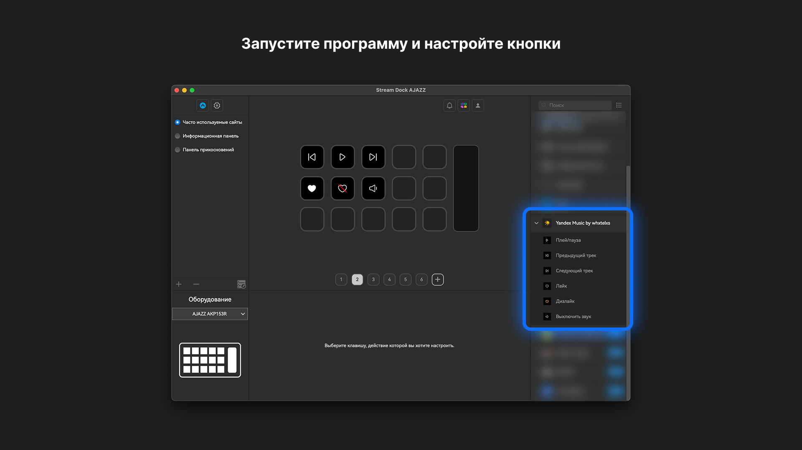
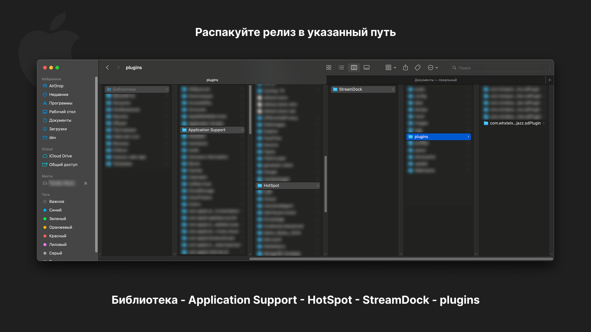
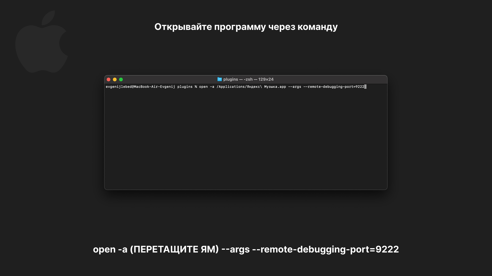
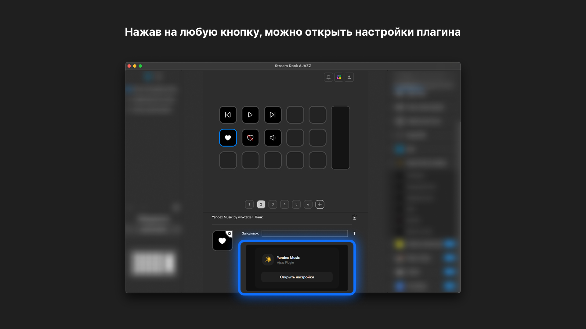

# Yandex Music Ajazz Plugin


Плагин для управления приложением Яндекс.Музыка с помощью Ajazz AKP 153 и других устройств StreamDock.

## Возможности

### Кнопки
- **Плей/Пауза** - воспроизведение и пауза трека
- **Следующий/Предыдущий трек** - переключение треков
- **Лайк/Дизлайк** - оценка текущего трека, у лайка отображается состояние
- **Случайный порядок** - включение и выключение shuffle с отображением состояния на кнопке
- **Повтор** - переключение режима повтора (выкл → список → один трек), иконка соответствует текущему режиму
- **Громкость + / Громкость −** - шаг изменения громкости настраивается в панели настроек (1-99%, по умолчанию 5%)
- **Выключить звук** - mute/unmute с отображением состояния
- **Запуск Yandex Music** - запускает Яндекс Музыку с портом отладки; при занятом порте автоматически подбирается ближайший свободный
- **Обложка трека** - обложка текущего трека; нажатие - плей или пауза
- **Обложка с прогрессом** - закругленная обложка с желтой обводкой по периметру, которая показывает прогресс трека; нажатие - плей/пауза
- **Прогресс трека** - круглый индикатор с процентом прошедшего трека внутри; нажатие - плей/пауза
- **Копировать ссылку на трек** - копирование в буфер обмена, работает и без включенного Discord. При успехе ничего не показывает, при ошибке на 2 секунды появляется значок ошибки
- **Название трека** - бегущая строка формата «Артист - Название»
- **Время трека** - текущее время / общая длительность

При переключении трека старая обложка остается до загрузки новой. Если обложки нет или загрузка завершилась ошибкой, показывается логотип. Прогресс учитывает паузу и перемотку, при смене трека сбрасывается.

### Энкодеры (крутилки)
- **Громкость (энкодер)** - вращение: изменение громкости, нажатие: mute/unmute
- **Перемотка (энкодер)** - вращение: перемотка трека, нажатие: плей/пауза
- **Треки (энкодер)** - вращение: следующий/предыдущий трек, нажатие: плей/пауза

### Информационный блок

В информационный блок StreamDock можно добавить плей/паузу, лайк, случайный порядок, повтор, обычную обложку и обложку с прогрессом, круглый прогресс, название и время трека. Состояние обновляется так же, как на кнопках.

### Панель настроек

Панель доступна по адресу **http://127.0.0.1:17890/**. Если порт занят, выбирается ближайший свободный.

В Property Inspector любой кнопки плагина нажмите **«Открыть настройки»** - откроется страница настроек в браузере по умолчанию с разделами:

| Раздел | Описание |
|--------|----------|
| **Соединение** | Порт отладки, запуск и перезапуск Яндекс Музыки, проверка соединения |
| **Громкость** | Шаг изменения громкости для кнопок и энкодера |
| **Текст** | Длина бегущей строки, размер шрифта названия и времени трека |
| **Discord** | Включение Rich Presence - текущий трек в статусе Discord |
| **Играет сейчас** | Виджет для OBS, оформление, предпросмотр и сохраненные конфиги |
| **Дебаг** | Режим отладки, цветные логи в реальном времени, очистка и выгрузка диагностики |
| **Обновления** | Проверка новых версий, описание релиза с Markdown и картинками, ссылка на релиз |
| **GitHub** | Сообщить о баге, предложить улучшение, открыть репозиторий или поддержать донатом |

Настройки можно открыть и напрямую по ссылке: **http://127.0.0.1:17890/**. StreamDock и плагин должны работать. Если порт занят, актуальный адрес доступен в логах плагина.

Настройки сохраняются автоматически. Уведомления показывают результат действий и подтвержденного сохранения. Если процесс плагина остановился, появляется экран с кнопкой **«Обновить»**.

### Discord Rich Presence

При включении в настройках плагин показывает в Discord текущий трек и исполнителя. Если статус не появляется - перезапустите Discord (`Ctrl+R`) и включите **Настройки → Конфиденциальность → Показывать текущую активность**.

### Играет сейчас для OBS

В настройках откройте **Играет сейчас**, выберите оформление и скопируйте ссылку. В OBS добавьте источник **Браузер**.

Обложка, название, исполнитель, время и прогресс обновляются автоматически. Цвета, размеры, шрифты и элементы можно менять прямо в настройках, ссылка остается той же. Есть восемь готовых вариантов оформления, плавные переходы при смене трека и возможность скрывать виджет на паузе.

Свои конфиги можно сохранять, переименовывать, дублировать и удалять. Доступно до 50 сохраненных конфигов. Удаление конфига не сбрасывает текущее оформление виджета.

StreamDock и плагин должны работать. По умолчанию ссылка: **http://127.0.0.1:17890/now-playing**. Если порт занят, копируйте актуальную ссылку из панели.

Если после обновления плагина OBS показывает старое оформление, в свойствах источника нажмите **«Обновить кеш текущей страницы»**.

## Совместимость

### Клавиатуры
- Ajazz AKP153
- Ajazz AKP05 (с энкодерами)
- Mirabox N4

### Системы
- Windows 11 24H2
- Windows 10
- MacOS 15

### Приложения
- Yandex Music 5.108.3+
- StreamDock 3.10.188.226+

## Установка

Скачайте последний релиз на [GitHub Releases](https://github.com/whxtelxs/Yandex-Music-Ajazz-Plugin/releases).

При обновлении полностью закройте StreamDock, замените папку плагина и запустите StreamDock заново.

<details>
<summary>Windows</summary>

1. Распакуйте папку плагина по пути:
   ```
   C:\Users\USERNAME\AppData\Roaming\HotSpot\StreamDock\plugins
   ```
   

2. Запустите Яндекс Музыку одним из способов:
   - **Через плагин** - добавьте кнопку **«Запуск Yandex Music»** или нажмите **«Запустить Yandex Music»** в настройках плагина
   - **Вручную** - создайте ярлык и укажите в параметрах:
     ```
     --remote-debugging-port=9222
     ```
   

3. Откройте StreamDock и настройте кнопки


</details>

<details>
<summary>MacOS</summary>

1. Распакуйте папку плагина по пути:
   ```
   Библиотека → Application Support → HotSpot → StreamDock → plugins
   ```
   

2. Запустите Яндекс Музыку одним из способов:
   - **Через плагин** - кнопка **«Запуск Yandex Music»** или запуск из настроек
   - **Вручную** - в терминале:
     ```
     open -a /Applications/Яндекс\ Музыка.app --args --remote-debugging-port=9222
     ```
   

3. Откройте StreamDock и настройте кнопки


</details>

## Настройка энкодеров

Для устройств с крутилками (например, Ajazz AKP05):

1. Откройте StreamDock и перейдите во вкладку **Knob**
2. Найдите категорию **Yandex Music**
3. Перетащите нужный энкодер на крутилку устройства:
   - **Громкость (энкодер)** - управление громкостью
   - **Перемотка (энкодер)** - перемотка и плей/пауза
   - **Треки (энкодер)** - переключение треков и плей/пауза

## Проверка соединения

Проверьте статус соединения одним из способов:

- В **настройках плагина** → раздел **Соединение** → **Проверить соединение**



> ⚠️ Если порт `9222` занят, плагин может запустить Яндекс Музыку на другом порту - актуальный порт отображается в настройках. Убедитесь, что приложение запущено с параметром `--remote-debugging-port`.

## Разработка и сборка релиза

### Требования

- Node.js 20+ и npm
- Полные исходники плагина

### Вёрстка панели без сборки релиза

В корневой папке проекта:

```bash
npm run dev
```

Откройте адрес из терминала, по умолчанию **http://127.0.0.1:17891/**. JSX и CSS обновляются автоматически, выбранный раздел сохраняется при перезагрузке. Тесты и ZIP при каждом изменении не запускаются.

Режим работает без StreamDock и устройства.

Для первого запуска установите зависимости через `npm ci --include=dev` в папке plugin. Исходники панели: propertyInspector/dashboard/src. Другой порт: `npm run dev -- --port=17900`.

Для пересборки только панели из корня: `npm --prefix plugin run ui:build`. Для готового архива используйте `npm run release`. Изменения серверного кода требуют перезапуска dev-режима.

### Сборка одной командой

В корневой папке проекта:

```bash
npm run release
```

Команда спросит версию: Enter оставляет текущую, новая версия автоматически записывается в manifest.json, package.json и package-lock.json. Затем при необходимости устанавливаются зависимости, проверяется синтаксис, запускаются тесты, собираются панель настроек, CSS и ZIP. При ошибке сборка останавливается.

Повторная сборка без вопроса о версии:

```bash
npm run release -- --keep-version
```

Готовые файлы:

```text
release/com.whxtelxs.streamdock.yandexmusic.sdPlugin/ - папка для установки
release/YandexMusic.Ajazz.Plugin.vX.Y.Z.zip           - архив релиза
```

### Автоматический черновик на GitHub

Каждый push в основную ветку запускает workflow Draft release. Он создаёт черновик версии из manifest.json и выполняет `npm run release -- --keep-version`: установку зависимостей, проверку синтаксиса, тесты, сборку панели, CSS и ZIP.

После успешной сборки в черновик добавляются ZIP, build-info.json и SHA256SUMS.txt. Тег vX.Y.Z указывает на собранный коммит. До публикации повторный push обновляет этот же черновик и тег, сохраняя описание релиза. При ошибке черновик получает пометку «сборка не прошла», опубликованные релизы не меняются.

Для следующей версии измените Version в manifest.json перед push. Команда release автоматически синхронизирует версии package.json и package-lock.json при сборке. Если текущая версия уже опубликована, workflow проверяет сборку, но не заменяет релиз и тег. Готовый черновик публикуется вручную кнопкой Publish release.

Workflow также можно повторить через Actions → Draft release → Run workflow на основной ветке. ZIP и build-info.json сохраняются в артефактах запуска. Используется встроенный GITHUB_TOKEN, отдельный секрет не нужен.

### Отдельные команды

Выполняются из папки plugin:

```bash
cd plugin
npm ci --include=dev
npm run check
npm test
npm run css:build
npm run ui:build
npm run prod
```

npm ci восстанавливает зависимости по lockfile. Для сборки нужны и devDependencies, в архив попадут только production зависимости. prod уже включает сборку панели и CSS, но не запускает check и test. 

Панель настроек на React и HeroUI v3 находится в propertyInspector/dashboard/src. npm run ui:build собирает JS и CSS в dashboard/dist. В OBS используется отдельный лёгкий виджет без React.

Стили Property Inspector редактируются в propertyInspector/tailwind.input.css. Файл propertyInspector/utils/tailwind.css создается сборкой.

## Обратная связь

- [Сообщить о баге](https://github.com/whxtelxs/Yandex-Music-Ajazz-Plugin/issues/new?template=bug_report.yml)
- [Предложить улучшение](https://github.com/whxtelxs/Yandex-Music-Ajazz-Plugin/issues/new?template=feature_request.yml)
- [Поставить звезду](https://github.com/whxtelxs/Yandex-Music-Ajazz-Plugin)
- [Поддержать проект](https://pay.cloudtips.ru/p/9b18bf34)

## Напоминание

> Пожалуйста, при создании плагинов под другие устройства и форков указывайте оригинальный репозиторий: [whxtelxs/Yandex-Music-Ajazz-Plugin](https://github.com/whxtelxs/Yandex-Music-Ajazz-Plugin).
