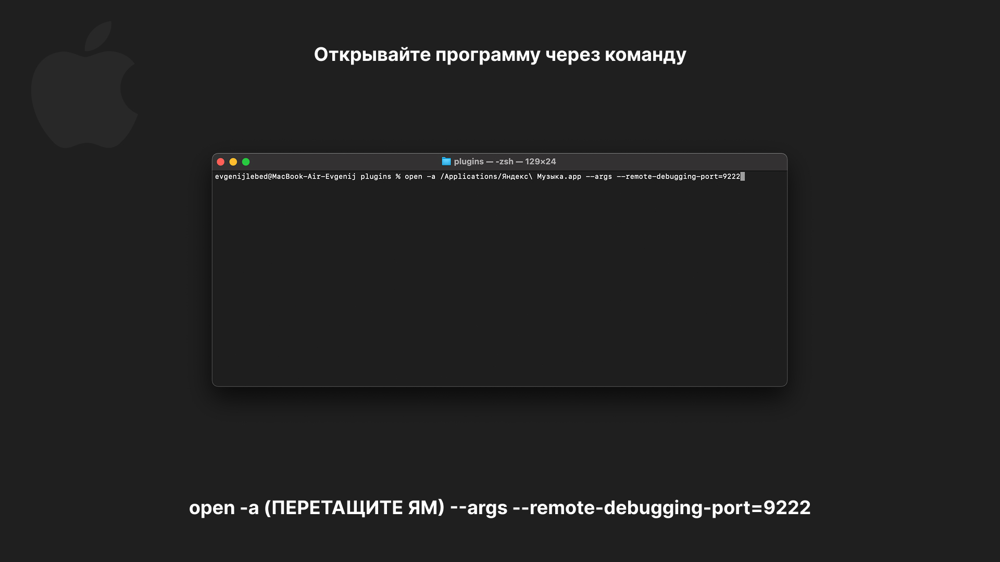

# Yandex Music Ajazz Plugin


Плагин для управления приложением Яндекс.Музыка с помощью Ajazz AKP 153.

## Возможности

- Воспроизведение/пауза трека
- Переключение на следующий/предыдущий трек
- Лайк/дизлайк текущего трека
- Включение/выключение звука

# Как запустить

## Windows

1. Скачайте релиз и распакуйте папку по пути 
  ```
C:\Users\USERNAME\AppData\Roaming\HotSpot\StreamDock\plugins
  ```


2. Создайте ярлык Яндекс музыки и в параметрах укажите 
  ```
--remote-debugging-port=9222
  ```


3. Запустите ярлык, откройте Ajazz и настройте кнопки


## MacOS

1. Скачайте релиз и распакуйте папку по пути 
  ```
Библиотека - Application Support - HotSpot - StreamDock - plugins
  ```


2. Откройте терминал и запустите Яндекс Музыку через команду 
  ```
open -a /Applications/Яндекс\ Музыка.app --args --remote-debugging-port=9222
  ```


3. Откройте Ajazz и настройте кнопки


Проверьте статус соединения, нажав на любую кнопку, а затем на Проверить соединение


> ⚠️ Убедитесь, что порт `9222` свободен и приложение Яндекс.Музыка не запущено до выполнения этих действий.